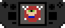

# DoomDeck

A launcher for Doom engine games with two main goals:

1. Be designed for Linux first, with the ability to discover installed applications and launch Flatpak-packaged source ports without filesystem access issues.
2. Provide a controller-focused interface that feels at home on the Steam Deck, while still supporting mouse input.

This project is still in a very early stage of development. Screenshots and an initial alpha release will be coming soon.

## Installation

TODO - these aren't actually available yet:
- the latest release can be downloaded as an AppImage from [here](../../releases/latest)
- On Fedora, DoomDeck is also available from the [electricbrass/doom](https://copr.fedorainfracloud.org/coprs/electricbrass/doom/) Copr repo

## Compiling

TODO - improve this, check that minimum compilers are correct:

required:
- cmake 4.0 or newer
- gcc 16 or newer
- clang 22 or newer
- ninja (version?)

optional:
- SDL3
- FreeType
- zlib-ng

Note: while compiling with clang is supported, libc++ is not supported *yet*, as DoomDeck uses a few features that are currently only available in libstc++.

## FAQ

**Does DoomDeck support my favorite Linux distribution?**

The AppImage should run on any distro with glibc 2.41 or newer.

**Will DoomDeck support Windows?**

Probably not. DoomDeck currently requires certain POSIX APIs and freedesktop.org standards that are not natively available on Windows, and there are plenty of good Doom launcher options on Windows already. If there is a strong enough demand, I may consider adding Windows support.

**Will DoomDeck support NetBSD?**

I'd like for it to! Currently, DoomDeck is only tested on Linux, but I plan to eventually provide proper support for NetBSD.

**Will DoomDeck support FreeBSD/OpenBSD/my favorite BSD?**

I don't plan to officially support these platforms, but I'll gladly accept contributions that improve/add support for them.

**Will DoomDeck support macOS?**

No.

## License

DoomDeck is licensed under the GNU General Public License, version 3.0 or later. See [COPYING](COPYING) for more information.

## Credits
DoomDeck was inspired by [Doomy](https://github.com/MTrop/Doomy) and Trov's DOOM Cannon concepts.
